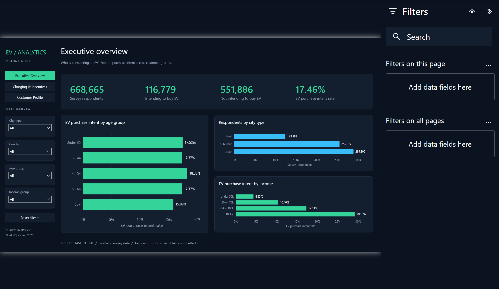
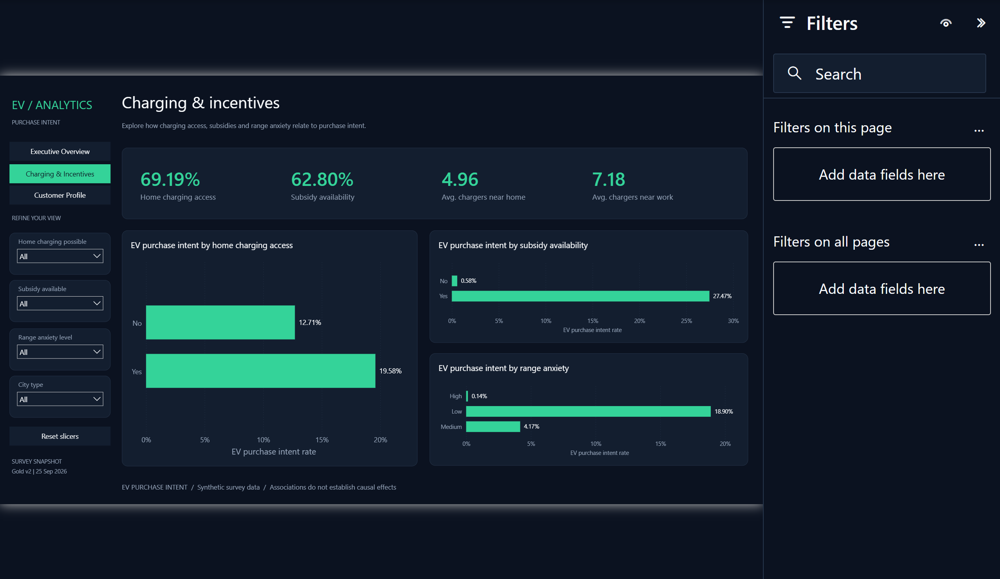
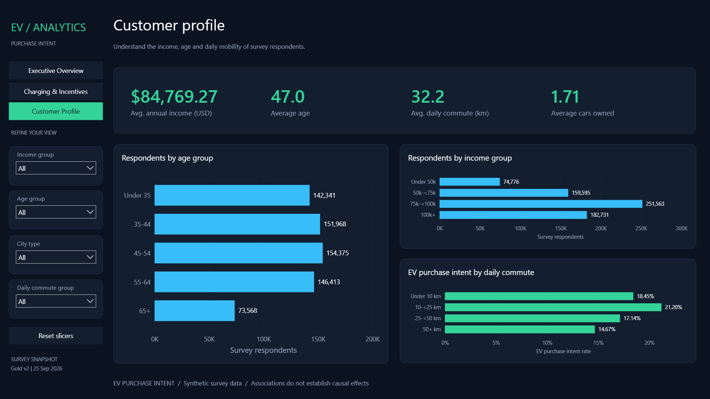

# Electric Vehicle Purchase Intent Analytics

An end-to-end data project that turns **668,665 customer records** into three Power BI dashboards explaining how EV purchase intent varies with income, charging access and incentives.

**Microsoft Fabric · Power BI · SQL · Python · PySpark · Airflow · Databricks · Azure DevOps**

## Business problem

Which customer groups express interest in an EV, and which conditions are associated with that interest? The project helps a manufacturer or dealership explore segments and form hypotheses for customer research and marketing.

The outcome is a descriptive analytics tool: **purchase intent, not actual sales or a prediction model**. The source is synthetic competition data, so the findings do not estimate real-world demand or establish causality.

## Dashboard

### Executive Overview

Compare overall intent, age, income and city segments.



### Charging & Incentives

Explore home charging, subsidies and range anxiety alongside purchase intent.



### Customer Profile

Compare segment size with intent rate across income, age, vehicle ownership and commuting patterns.



[Open the published report](https://app.powerbi.com/groups/5fe78794-25c3-41ee-b35e-bc56542d2cea/reports/ae4d7c59-759e-4462-afed-1717475ae012) with workspace access, or inspect the [Power BI project](RPT_EV_Analytics.pbip). Screenshots can be viewed without a cloud account.

## Key findings

**116,779 of 668,665 respondents express purchase intent: 17.46%.**

| Pattern in the dataset | Result | Business implication to investigate |
| --- | --- | --- |
| Annual income | 29.18% intent at USD 100,000+ vs 4.35% below USD 50,000 | Test affordability and total-cost-of-ownership messaging. |
| Subsidy availability | 27.47% with subsidies vs 0.58% without | Include incentive eligibility in customer research. |
| Home charging | 19.58% with access vs 12.71% without | Investigate charging feasibility and installation support. |
| Segment size vs rate | Rural intent is 19.34% vs 16.11% urban, but urban has 46,595 interested respondents vs 23,977 rural | Consider both interested-record count and rate when comparing segments. |

Figures come from the [reference segment metrics](metadata/star_expected_metrics.json). These are unadjusted associations; no campaign uplift, sales conversion or ROI has been measured.

## Architecture and technical work


| Area | Implementation |
| --- | --- |
| Data engineering | Fabric/OneLake Bronze–Silver–Gold pipeline, schema and checksum validation, lineage and quality gates. |
| Data modeling | One respondent-level fact, five dimensions, two audit aggregates; 12 DAX measures. |
| Analytics | Segment comparisons for income, demographics, mobility, charging and incentives. |
| Orchestration | Standalone PySpark with an Airflow DAG, controlled retries and integrity checks before publication. |
| Cross-platform execution | Databricks serverless runtime with eight-table Gold reconciliation against the standalone output. |
| Delivery | Azure CI tests and package verification; Test deployment with refresh, binding and KPI checks. |

Power BI uses the Fabric model. Databricks demonstrates an alternative data-processing path. See [validation and limitations](docs/validation.md), [star schema](docs/architecture/star_schema.md) and [semantic model](docs/architecture/semantic_model.md).

## Data

Source: Kaggle Playground Series S6E9, *Predicting Electric Vehicle Purchases*, and its original reference dataset. [Provenance and SHA-256](metadata/source_manifest.json) identify the acquired files; direct comparison with a Kaggle download remains unverified.

| File | Rows | Purpose |
| --- | ---: | --- |
| `train.csv` | 668,665 | Labeled analytical population; target `Will_Buy_EV`. |
| `test.csv` | 286,571 | Unlabeled competition data, excluded from intent rates. |
| `EV_Adoption_and_Range_Anxiety_Dataset.csv` | 10,000 | Separate reference data, not combined with training records. |
| `sample_submission.csv` | 286,571 | Competition template, excluded from analytical outcomes. |

[Data dictionary](docs/architecture/data_dictionary.md). Raw data is obtained separately and is not stored in Git.

## Run locally

Place the four source CSVs in `data/raw/kaggle/`, matching the manifest. Prepare Python, Java 17 and the [PySpark runtime](docs/pipelines/standalone_pipeline.md#runtime-windows), then run:

```bash
python -m pip install -r requirements.txt -r requirements/requirements_phase10.txt
python -m src.run_pipeline --raw data/raw/kaggle --output-root output/local
```

Each run writes to `output/local/runs/<run_id>/`. Inspect `run_report.json` and `published.json`; publication requires passing quality and integrity checks. Opening the live Power BI report requires access to the configured Fabric model. Cloning the repo does not provision cloud resources.

## Explore the code

| Location | What to review |
| --- | --- |
| `src/`, `dags/`, `docker/` | Transformations, quality rules and Airflow orchestration. |
| `databricks/` | Serverless runtime, notebook and job configurations. |
| Fabric item folders, `notebooks/` | Lakehouse, notebook and pipeline definitions. |
| Power BI item folders, `models/` | Report visuals, semantic model and model snapshot. |
| `sql/`, `metadata/`, `config/` | Reconciliation queries, runtime contracts and environment mappings. |
| `scripts/`, `tests/`, `ci/` | Reusable utilities, automated regression tests and CI/CD. |
| `docs/` | Data model, screenshots and technical runbooks. |

Technical guides: [Fabric](docs/pipelines/pipeline_runbook.md) · [PySpark/Airflow](docs/pipelines/standalone_pipeline.md) · [Databricks](docs/pipelines/phase11_databricks.md) · [CI/CD](docs/deployment/test_cd.md) · [tests](tests/README.md) · [recovery](docs/recovery/recovery_runbook.md).
