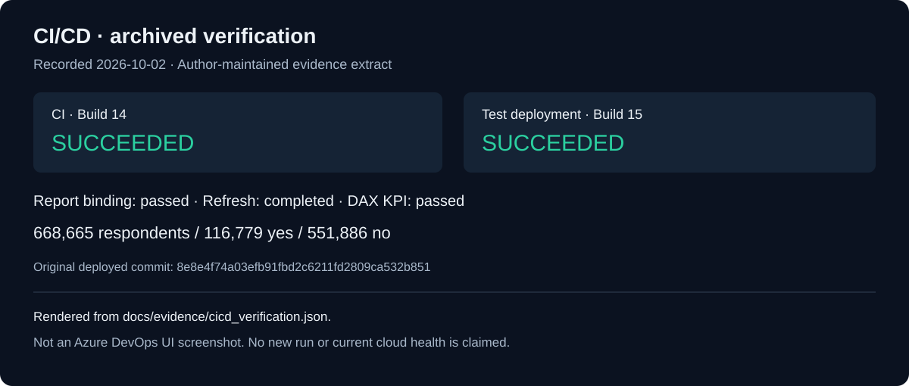

# CI/CD evidence

This image renders an **archived verification record**, not the Azure DevOps UI. It documents the run recorded on **2 October 2026**; it does not claim that the pipeline was rerun or that cloud resources are healthy today.

| Check | Recorded result |
| --- | --- |
| CI | Build 14 succeeded |
| Test deployment | Build 15 succeeded |
| Report-to-model binding | Passed |
| Semantic model refresh | Completed |
| DAX KPI reconciliation | Passed: 668,665 respondents / 116,779 yes / 551,886 no |
| Rollback capture | Captured during build 15 |

Read the [sanitized evidence JSON](evidence/cicd_verification.json) for timestamps, the original deployed commit, failed attempts preceding the successful run, and the source-record checksum. Workspace IDs, connection IDs, account details and private artifact paths have been omitted. The extract is maintained by the author and is not an independent attestation.

Original Azure DevOps source commit: `8e8e4f74a03efb91fbd2c6211fd2809ca532b851`. Historical source identities remain recorded as plain text; privacy cleanup of public Git history can change GitHub commit hashes.

The Azure DevOps project requires access. Public readers can inspect the [CI YAML](../ci/azure_pipelines.yml), [CD YAML](../ci/azure_pipelines_test_cd.yml), [deployment procedure](deployment/test_cd.md) and evidence above without an account. An original Azure DevOps UI screenshot is not included.
