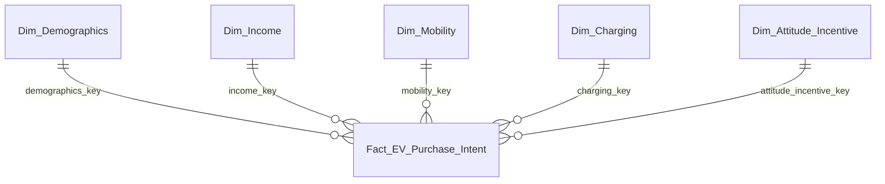

# Gold v2 Star Schema

## Design decision

Keep `LH_EV_Gold` (Delta Lakehouse). Stage 5 permits Warehouse **or** Lakehouse;
a star schema is a logical design and does not require adding a Warehouse.
The existing Spark transformation and immutable snapshot publication are retained.

One fact row is one labeled synthetic train respondent. It measures purchase
intent, not completed sales or revenue. There is no business date and no date
dimension. Technical processing timestamps are hidden from report authors.

| Role | Grain / attributes | Rows in pinned dataset |
| --- | --- | ---: |
| fact_ev_purchase_intent | One respondent ID; five dimension keys, numeric observations, Yes/No outcome, lineage | 668665 |
| dim_demographics | age_band, Gender, City_Type | 45 |
| dim_income | income_band | 4 |
| dim_mobility | commute_band, Current_Car_Type | 16 |
| dim_charging | Home_Charging_Possible | 2 |
| dim_attitude_incentive | Environmental_Concern_Level, Subsidy_Available, Range_Anxiety_Level | 30 |
| agg_ev_kpi | Whole train snapshot (audit only) | 1 |
| agg_ev_segments | Single dimension/value summary (audit only) | 35 |



Dimensions describe distinct attribute combinations, not identifiable customers.
Exact age, income, commute, car and charger counts stay on the fact for averages.
Band label columns live only on dimensions, with numeric sort columns.
All Power BI relationships are active Many-to-One from fact to dimension;
filters flow only from dimension to fact. No bidirectional or many-to-many joins.

Keys use SHA-256 of a compact UTF-8 JSON array `[dimension_role, attribute1, ...]`.
Every attribute is a non-null string, in the declared order. This avoids delimiter
ambiguity and gives stable keys across runs and partitions. The pipeline also
checks uniqueness to catch collisions. Null attributes are rejected under the
existing strict train contract; no silent Unknown member is manufactured.

Every physical table is suffixed with the Gold run ID. Dimensions are immutable
snapshot dimensions, not SCD2 customer history. All eight tables carry the same
Silver/Gold lineage. There is no atomic multi-table write: only the final success
marker and E2E audit authorize consumption, and all model partitions must use one
verified run. Old v1 snapshots remain intact.

## Verification

Before publication and again in Validate_Gold, the notebook checks:

1. Expected fact and dimension counts, unique/non-null primary keys, unique
   dimension business tuples, deterministic keys and correct band sort values.
2. Non-null fact foreign keys and zero unmatched dimension keys.
3. Joining all five dimensions reconstructs **every enriched Silver column**,
   with exact multiset equality in both directions, including respondent ID.
4. Spark SQL calculates the overall counts/rate and all 35 segment groups;
   results must match the independent source reference and current Silver totals.
5. Readback comes from Delta version 0 and lineage matches the same pipeline run.

Publication includes `gold_schema_version: 2`, both validation results, table
schemas and dimension counts. Missing/failed checks prevent publication.
`metadata/star_expected_metrics.json` records the independent full local
pandas/SQLite result, not a Fabric execution. Unit tests inject orphan keys,
duplicate dimensions/facts, changed attributes/outcomes and invalid markers.

The notebook also writes `Files/sql/<gold_run_id>_reconciliation.sql`. Execute it
on the **LH_EV_Gold SQL analytics endpoint** after metadata synchronization.
It checks KPI/segments, FK/PK errors, and all original business fields against
`LH_EV_Silver.dbo.silver_train_<silver_run_id>`. Cross-database access requires
permission to both endpoints. Spark SQL success does not prove endpoint access.

## Rollout

1. Sync the updated `NB_EV_Silver_To_Gold` and `NB_EV_Bronze_To_Silver` from
   Git, or import the generated ipynb files into the existing notebooks while
   preserving their IDs. The pipeline already references these existing IDs.
2. Run `PL_EV_E2E`. Require all five activities to succeed. The final audit must
   say `gold_schema_version: 2`, `star_validation.status: passed`, and
   `sql_validation.status: passed`. Download that audit to metadata.
3. Do **not** deploy the current SemanticModel draft while its partitions contain
   `pending_star_v2`. These placeholders prevent accidentally binding the new
   star model to incompatible legacy wide tables.
4. Connect to the local TMDL using Power BI Modeling MCP. Prepare the binding:

   ```powershell
   python scripts/prepare_star_binding.py --audit metadata/e2e_star_verified_run.json --connection-name "<MCP connection name>"
   ```

   Apply `metadata/star_model_binding_request.json` with Modeling MCP
   `table_operations`, then export TMDL. The helper refuses legacy, incomplete
   or mixed-run audits. It also creates runnable `sql/gold_reconciliation.sql`.
5. Deploy `SM_EV_Analytics`, configure its authorized data connection and refresh.
   Run the endpoint SQL and `tests/semantic_model_validation.dax`; reconcile all
   35 groups and test combined dimension filters before building the report.

The current tool set can upload OneLake files and trigger pipelines, but does
not expose notebook-definition update or Fabric Git sync. No old notebook run
is represented as a v2 validation. Browser automation is excluded by request.

## Rebuild

```powershell
python scripts/profile_star.py
python scripts/build_gold_notebook.py
python scripts/build_fabric_notebook.py
python -m unittest discover -s tests -v
```

References: [Microsoft star schema guidance](https://learn.microsoft.com/en-us/power-bi/guidance/star-schema),
[querying SQL analytics endpoints](https://learn.microsoft.com/en-us/fabric/data-warehouse/query-warehouse).
